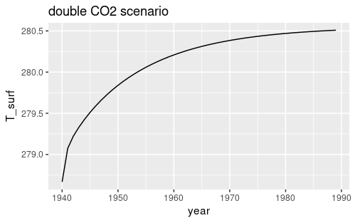
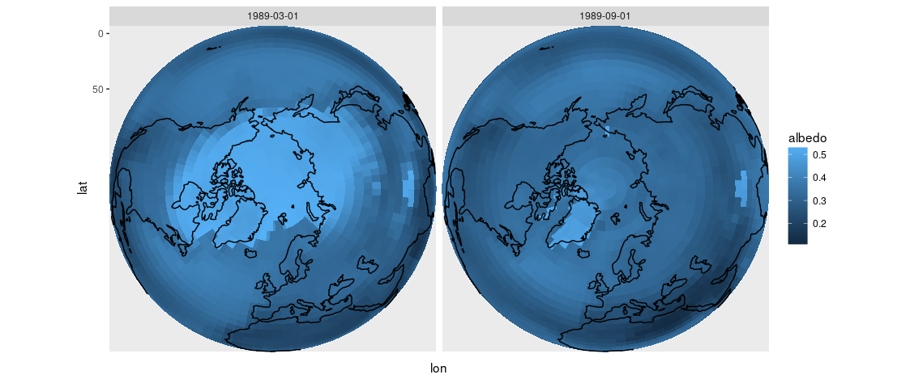

# Globally Resolved Energy Balance (GREB) Climate Model

GREB is a very simple, globally resolved energy balance model, which is capable of simulating the main characteristics of global climate change. The model fills the gap between strongly simplified 1d energy balance models and fully coupled 4-dimensional climate models. The [source code](src/greb.f90) is about 1000 lines of fortran, and the model currently runs at about 1 simulated year per second on a standard laptop.

*Dommenget, D., and J. Floeter 2011: Conceptual Understanding of Climate Change with a Globally Resolved Energy Balance Model. Climate dynamics, 2011, 37, 2143-2165.* [link](http://users.monash.edu.au/~dietmard/papers/dommenget.and.floeter.greb.paper.cdym2011.pdf), [pdf (not on github)](dommenget2011greb.pdf) 

## Compile and run

```
make greb
./greb
```

Under the default setting `greb` simulates 50 years of climate under a double CO2 scenario (starting from 1940), and saves monthly means of surface temperature, air temperature, ocean temperature, humidity, and albedo in the file `output/scenario`.

I have altered the original `greb` code quite substantially to be able to change the model parameters. To run the original code (with only minor modifications), use the make target `greb-original`.


## R analysis code 

There is some R code in the repository to load the model output into data frames for further processing.

```r
source('R/functions.R')
tstamps = seq.Date(from=as.Date('1940-01-01'), by='1 month', len=50*12)
tsurf   = read_greb(file='output/scenario', tstamps=tstamps, varname='tsurf', ivar=1, nvar=5)
```


### Rising annual global mean temperature after doubling CO2

```r
tsurf = tsurf %>% mutate(tsurf=tsurf-273.15, coslat = cos(lat/180*pi)) %>% 
        group_by(year=year(time)) %>% summarise(T_surf=weighted.mean(tsurf, w=coslat))
ggplot(tsurf) + geom_line(aes(x=year, y=T_surf)) + ggtitle('double CO2 scenario')
```




### Melting ice in the Arctic, as indicated by decreasing albedo

```r
load('data/ne_coast.Rdata')
albedo = read_greb(file='output/scenario', tstamps=tstamps, varname='albedo', ivar=5, nvar=5)
albedo = albedo %>% filter(year(time) %in% c(1940, 1989), month(time)==9) %>% 
         mutate(time=ymd(time), albedo = ifelse(albedo < 0.4, '< 0.4', '>= 0.4'))
ggplot(albedo) + facet_wrap(~time) + coord_map('ortho', ylim=c(50,90)) + theme_void() +
  geom_tile(aes(x=lon, y=lat, fill=albedo)) +  
  geom_path(data=ne_coast, mapping=aes(x=long, y=lat, group=group))
```




## References

Dommenget, D., and J. Floeter 2011: Conceptual Understanding of Climate Change with a Globally Resolved Energy Balance Model. Climate dynamics, 2011, 37, 2143-2165. [link](http://users.monash.edu.au/~dietmard/papers/dommenget.and.floeter.greb.paper.cdym2011.pdf)

[Project website](http://users.monash.edu.au/~dietmard/content/GREB/GREB_model.html)

[Code archive](http://users.monash.edu.au/~dietmard/content/GREB/code_files/greb.web-public.tar.zip) (zip, 65Mb)

The github repo [alex-robinson/greb-ucm](https://github.com/alex-robinson/greb-ucm) contains the model with a few modifications. They also have R code for data handling and plotting, but I chose to write my own.


## Notes

### Sea ice

**Dommenget & Floeter (2011), 3.6 Sea ice**: The effect of changes in sea ice cover is only considered in the changes of the effective heat capacity c surf , which changes from the oceans mixed layer values to a 2 m water column over a transition temperature interval, see Fig. 3b. The change in heat capacity goes parallel with the change in the albedo (Fig. 3a). Latent heat releases by freezing and melting are neglected.

In the source code, the relevant lines for sea ice are:

```{fortran}
! Ocean: ice -> albedo/heat capacity linear function of T_surf
  where(z_topo < 0. .and. Tsurf <= To_ice1) a_surf = a_no_ice+da_ice      ! ice
  where(z_topo < 0. .and. Tsurf >= To_ice2) a_surf = a_no_ice             ! no ice
  where(z_topo < 0. .and. Tsurf > To_ice1 .and. Tsurf < To_ice2 ) &
&       a_surf = a_no_ice+da_ice*(1-(Tsurf-To_ice1)/(To_ice2-To_ice1))
```

### Glaciers 

Glaciers are prescribed, they do not grow or melt.


### Winds

Wind fields are prescribed, two fields per day, repeated each year.
Wind fields only acts to redistribute heat and moisture through advection.


